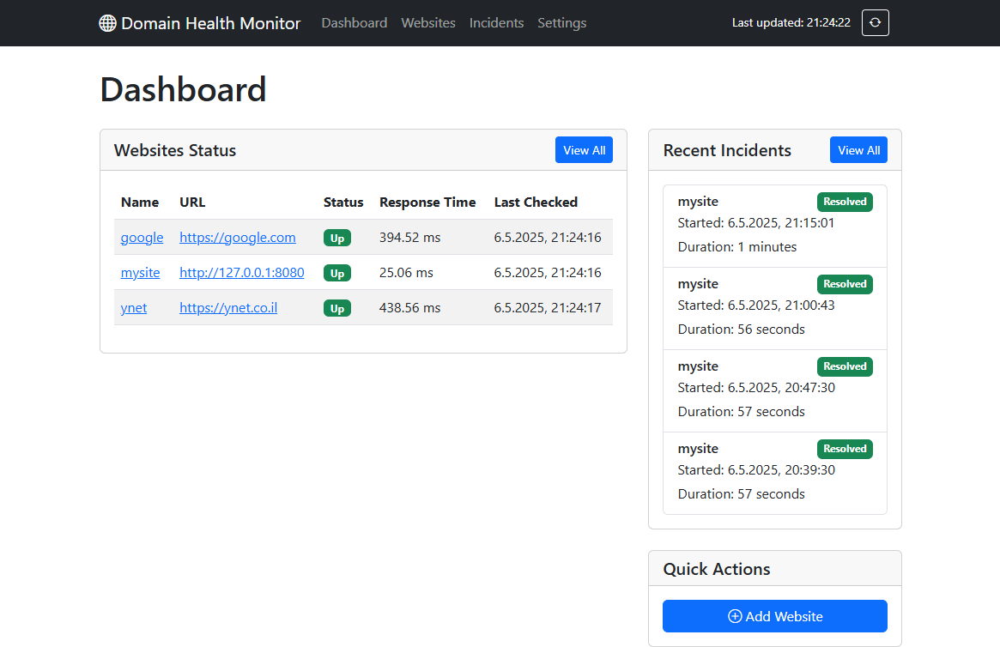

# Personal Domain Health Monitor

A comprehensive self-hosted solution for monitoring website uptime, performance, SSL certificates, and security status. This desktop application provides real-time monitoring, detailed analytics, and alert capabilities to help ensure your domains stay online and secure.



## Features

### Website Monitoring
- **Uptime Tracking**: Regular automated health checks at configurable intervals
- **Performance Metrics**: Response time measurement and trending
- **SSL Certificate Validation**: Monitor certificate validity and expiration dates
- **Security Assessment**: Analysis of security headers with scoring
- **Network Checks**: Ping tests for basic connectivity

### Incident Management
- Automatic detection and tracking of downtime incidents
- Duration calculation and resolution monitoring
- Historical incident records and reporting

### Visualizations
- Uptime percentage charts over time
- Response time trend analysis
- Security score assessment
- Daily performance statistics

### Alerting System
- Email notifications via SMTP
- SMS alerts via Twilio integration
- Notifications for downtime and recovery events
- SSL certificate expiration warnings

### User-Friendly Dashboard
- Real-time status overview
- Detailed per-website analytics
- Simple website management interface
- Customizable configuration settings

## Requirements

- Python 3.7 or higher
- Internet connection for monitoring external websites
- SMTP server access for email notifications (optional)
- Twilio account for SMS notifications (optional)

## Installation

1. Clone the repository or download the latest release:
   ```bash
   git clone https://github.com/noam466sdrthfdht/P.d.h-monitor.git
   cd domain-health-monitor
   ```

2. Install required dependencies:
   ```bash
   pip install -r requirements.txt
   ```

3. Edit the `config.yaml` file with your settings (see Configuration section below)

4. Run the application:
   ```bash
   run start.bat
   ```

## Configuration

Edit the `config.yaml` file to customize the application settings:

```yaml
database_path: domain_monitor.db
monitor_settings:
  check_interval_minutes: 5
  retry_attempts: 2
  connection_timeout: 10
email_settings:
  smtp_server: smtp.gmail.com
  smtp_port: 587
  smtp_username: your_email@gmail.com
  smtp_password: your_app_password
  from_email: your_email@gmail.com
sms_settings:
  twilio_account_sid: your_twilio_account_sid
  twilio_auth_token: your_twilio_auth_token
  twilio_phone_number: your_twilio_phone_number
http_settings:
  default_headers:
    User-Agent: Domain-Health-Monitor/1.0
    Accept: text/html,application/xhtml+xml,application/xml;q=0.9,image/webp,*/*;q=0.8
```

### Email Configuration - optional (beta)

For Gmail, you'll need to create an App Password if you have 2FA enabled:
1. Go to your Google Account → Security → App passwords
2. Select "Mail" and "Other" (Custom name)
3. Enter "Domain Health Monitor" and click Generate
4. Use the generated password in the `smtp_password` field

### SMS Configuration - optional (beta)

To enable SMS alerts:
1. Sign up for a Twilio account at [twilio.com](https://www.twilio.com)
2. Get your Account SID and Auth Token from the Twilio dashboard
3. Purchase a phone number through Twilio
4. Add these details to the configuration file

## Usage

### Adding Websites to Monitor

1. Start the application
2. Click "Add Website" on the dashboard
3. Enter the website details:
   - Name: A friendly name for the website
   - URL: The full URL including http:// or https://
   - Description: Optional information about the site
   - Check options: SSL, Security, Alerts
   - Alert emails: Email addresses for notifications
   - Alert phone: Phone number for SMS alerts (with country code)

### Viewing Website Status

- The dashboard shows an overview of all monitored websites
- Click on a website name to see detailed statistics:
  - Current status
  - Uptime percentage
  - Response time trends
  - SSL certificate information
  - Security score
  - Recent incidents and checks

### Managing Incidents

- The Incidents page shows all downtime events
- Filter by website or status (ongoing/resolved)
- View details such as start time, duration, and resolution status

### Application Settings

Configure the application by clicking the Settings link:
- Database location
- Check interval and timeout settings
- Email and SMS notification settings
- HTTP request parameters


## Troubleshooting

### Email Notifications Not Working

1. Verify your SMTP settings are correct
2. For Gmail, ensure you're using an App Password if 2FA is enabled
3. Check if your email provider blocks automated emails

### Website Status Always Shows "Down"

1. Verify the URL is correct and accessible
2. Check your internet connection
3. The website might be blocking the monitoring requests
4. Try increasing the connection timeout in settings

### Application Won't Start

1. Ensure all dependencies are installed: `pip install -r requirements.txt`
2. Check if port 5000 is already in use by another application
3. Verify you have write permissions in the application directory
4. Check the logs in `domain_monitor.log` for error details


## Acknowledgments

- [Flask](https://flask.palletsprojects.com/) for the web dashboard
- [Bootstrap](https://getbootstrap.com/) for the UI components
- [Chart.js](https://www.chartjs.org/) for data visualization
- [Twilio](https://www.twilio.com/) for SMS notification capabilities
